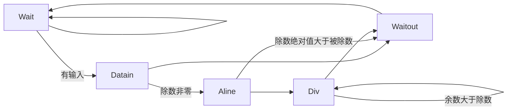

# NSCSCC2023 LoongArch团体赛

> 中国科学技术大学2队 Crepper 2023.8

## 成员

来泽远  曹宸瑞  徐航宇  徐翊然

## 设计简介

我们设计的 CPU 采用顺序双发射八级流水，实现了 63 条指令、26 种 CSR 寄存器、16 种例外[^0]。采用 AXI-4 总线。使用 2 路组相联 16KB icache 和；2 路组相联 16KB dcache，采用写直达，非写分配策略；8 路组相联L2cache，采用写回、写分配策略。使用分支预测器以减少分支失败带来的性能损失。

### 指令列表

| 指令名称  |  ISA 指令类型  | 微结构指令类型 |
| :-------: | :------------: | :------------: |
| RDCNTID.W |  其他杂项指令  |      ALU       |
| RDCNTVL.W |  其他杂项指令  |      ALU       |
| RDCNTVH.W |  其他杂项指令  |      ALU       |
|   ADD.W   | 算术运算类指令 |      ALU       |
|   SUB.W   | 算术运算类指令 |      ALU       |
|    SLT    | 算术运算类指令 |      ALU       |
|   SLTU    | 算术运算类指令 |      ALU       |
|    NOR    | 算术运算类指令 |      ALU       |
|    AND    | 算术运算类指令 |      ALU       |
|    OR     | 算术运算类指令 |      ALU       |
|    XOR    | 算术运算类指令 |      ALU       |
|   SLL.W   | 移位运算类指令 |      ALU       |
|   SRL.W   | 移位运算类指令 |      ALU       |
|   SRA.W   | 移位运算类指令 |      ALU       |
|   MUL.W   | 算术运算类指令 |      MUL       |
|  MULH.W   | 算术运算类指令 |      MUL       |
|  MULH.WU  | 算术运算类指令 |      MUL       |
|   DIV.W   | 算术运算类指令 |      DIV       |
|   MOD.W   | 算术运算类指令 |      DIV       |
|  DIV.WU   | 算术运算类指令 |      DIV       |
|  MOD.WU   | 算术运算类指令 |      DIV       |
|   BREAK   |  其他杂项指令  |      PRIV      |
|  SYSCALL  |  其他杂项指令  |      PRIV      |
|  SLLI.W   | 移位运算类指令 |      ALU       |
|  SRLI.W   | 移位运算类指令 |      ALU       |
|  SRAI.W   | 移位运算类指令 |      ALU       |
|   SLTI    | 算术运算类指令 |      ALU       |
|   SLTUI   | 算术运算类指令 |      ALU       |
|  ADDI.W   | 算术运算类指令 |      ALU       |
|   ANDI    | 算术运算类指令 |      ALU       |
|    ORI    | 算术运算类指令 |      ALU       |
|   XORI    | 算术运算类指令 |      ALU       |
|   CSRRD   |  CSR 访问指令  |      PRIV      |
|   CSRWR   |  CSR 访问指令  |      PRIV      |
|  CSRXCHG  |  CSR 访问指令  |      PRIV      |
|   CACOP   | Cache 维护指令 |     CACHE      |
|   ERTN    |  其他杂项指令  |      PRIV      |
|   IDLE    |  其他杂项指令  |      PRIV      |
|  LU12I.W  | 算术运算类指令 |      ALU       |
| PCADDU12I | 算术运算类指令 |      ALU       |
|   LL.W    |  原子访存指令  |      MEM       |
|   SC.W    |  原子访存指令  |      MEM       |
|   LD.B    |  普通访存指令  |      MEM       |
|   LD.H    |  普通访存指令  |      MEM       |
|   LD.W    |  普通访存指令  |      MEM       |
|   ST.B    |  普通访存指令  |      MEM       |
|   ST.H    |  普通访存指令  |      MEM       |
|   ST.W    |  普通访存指令  |      MEM       |
|   LD.BU   |  普通访存指令  |      MEM       |
|   LD.HU   |  普通访存指令  |      MEM       |
|   PRELD   |  普通访存指令  |      MEM       |
|   DBAR    |    栅障指令    |     CACHE      |
|   IBAR    |    栅障指令    |     CACHE      |
|   JIRL    |    转移指令    |       BR       |
|     B     |    转移指令    |       BR       |
|    BL     |    转移指令    |       BR       |
|    BEQ    |    转移指令    |       BR       |
|    BNE    |    转移指令    |       BR       |
|    BLT    |    转移指令    |       BR       |
|    BGE    |    转移指令    |       BR       |
|   BLTU    |    转移指令    |       BR       |
|   BGEU    |    转移指令    |       BR       |

### CSR寄存器列表

|    地址     |    名称     |
| :---------: | :---------: |
|     0x0     |    CRMD     |
|     0x1     |    PRMD     |
|     0x2     |    EUEN     |
|     0x4     |    ECFG     |
|     0x5     |    ESTAT    |
|     0x6     |     ERA     |
|     0x7     |    BADV     |
|     0xC     |   EENTRY    |
|    0x10     |   TLBIDX    |
|    0x11     |   TLBEHI    |
|    0x12     |   TLBELO0   |
|    0x13     |   TLBELO1   |
|    0x18     |    ASID     |
|    0x19     |    PGDL     |
|    0x1A     |    PGDH     |
|    0x1B     |     PGD     |
|    0x20     |    CPUID    |
|  0x30~0x33  | SAVE0~SAVE3 |
|    0x40     |     TID     |
|    0x41     |    TCFG     |
|    0x42     |    TVAL     |
|    0x44     |    TICLR    |
|    0x60     |   LLBCTL    |
|    0x88     |  TLBRENTRY  |
|    0x98     |    CTAG     |
| 0x180~0x181 |  DMW0~DMW1  |

### 例外列表

| Ecode | EsubCode | 例外代号 |
| :---: | :------: | :------: |
|  0x0  |    0     |   INT    |
|  0x1  |    0     |   PIL    |
|  0x2  |    0     |   PIS    |
|  0x3  |    0     |   PIF    |
|  0x4  |    0     |   PME    |
|  0x7  |    0     |   PPI    |
|  0x8  |    0     |   ADEF   |
|  0x8  |    1     |   ADEM   |
|  0x9  |    0     |   ALE    |
|  0xB  |    0     |   SYS    |
|  0xC  |    0     |   BRK    |
|  0xD  |    0     |   INE    |
|  0xE  |    0     |   IPE    |
|  0xF  |    0     |   FPD    |
| 0x12  |    0     |   FPE    |
| 0x3F  |    0     |   TLBR   |

## 流水线功能设计

CPU 采用顺序双发射八级流水结构，流水线分为 IF0、IF1、FIFO、ID、REG、EXE0、EXE1、WB 八级。


图中， 除了 AXI interconnect 借鉴了以 MIT license 分发的 verilog-axi [^1]并修改、所有BRAM生成代码均使用 Xilinx 标准生成代码以增加灵活性，其余所有模块都由我们独立实现。


## 执行单元设计

执行单元采用双发射形式：

- 一路为全能单元，可以执行全部指令，在指令到达时将其放入 ALU, BR, DIV, PRIV, MUL, DCache, RDCNT 执行路径之一或之二。
- 另一路仅可执行 ALU, BR, MUL, RDCNT 指令。

### Fetch Buffer

采用 FIFO 队列，存储 ICache 发出的指令，并在 ICache 访问 AXI 总线时能持续发出存储的指令。

### Dispatcher

处理数据相关与 Load and Use 等相关，与前递模块一同保证发送出的指令不会使用错误数据，同时返回发送信息使FIFO队列移位。


### Arithmetic Logic Unit (ALU)

ALU 单元可以执行 ADD.W、SUB.W、SLT、SLTU、AND、OR、NOR、XOR、SLL.W、SRL.W、SRA.W、SLLI.W、SRLI.W、SRAI.W、SLTI、SLTUI、ADDI.W、ANDI、ORI、XORI、LU12I.W、PCADDU12I 共 22 种运算。在得到运算结果后，向后空流水一级，以便与两级流水的运算单元补齐。

### Branch Unit (BR)

BR 单元可以执行 JIRL、B、BL、BEQ、BNE、BLT、BGE、BLTU、BGEU 共 9 种分支指令，并对分支预测结果进行检验。下一条指令方向的 PC 与跳转方向不一致时，选择刷新单条指令或刷新整条流水线。第一阶段仅进行 ALU 运算，第二周期发出反馈，以缩短关键路径。


### Divider (DIV)

DIV 单元可以执行 DIV.W、MOD.W、DIV.WU、MOD.WU 共 4 种除法指令。采用提前开始方式，既多花费一个周期比较除数与被除数的位数差，达到减少除法周期的目的。使用状态机控制，当进行除法时，将流水线阻塞。而且在除数为0时结果输出0，同时不进入除法状态，以节约周期及防止流水线阻塞。为了优化前递路径，增加了一输入状态及输出状态，不做除数据传输外的其他工作，同时stall信号仅与内部状态有关。最后，在收到stall时若内部在做除法则继续除法，不响应stall，stall仅确保在等待态时不会进入其他态，以此节约时间。状态机如下：



### CSR Control

单元采取流水化访问，在第一周期读 CSR 寄存器，第二周期写 CSR 寄存器。但是由于 CSR 与取指阶段的例外、正确性密切相关，因此一旦修改 CSR 就一定冲刷流水线。同时留下接口，为之后实现 MMU 准备。（实际上已经实现了所有 TLB 相关指令并可两周期完成，但初赛不要求所以 TLB 没有放入）

### Memory Maping Unit (MMU)

初赛仅要求实现 DMW 及直接地址映射，故实现了简单的 MMU ，对输入虚地址作简单比较后直接输出实地址，但保留报 ADEM, ADEF 的能力。

### Multiplier (MUL)

MUL采用拆分乘法，将输入 32 位数拆分为两个 16 位数分别相乘，同时考虑符号后输出结果，这样可以充分简化设计，同时乘法器不在关键路径上。数学原理为：

$$
(2^{16}a+b)(2^{16}c+d)=2^{32}ac+2^{16}(bc+ad)+bd
\\-2^{32}(a[15](2^{16}c+d)+c[15](2^{16}a+b))
$$

其中最后减项仅在计算 MUL.W 时生效，a[15]，c[15]表示输入数符号位。

## 分支预测器设计
### 综述
由于本架构中流水级较多，冲洗流水线的代价较大，因此，我们配置了分支预测器，通过记录并分析分支指令的历史行为，以尝试对跳转指令进行预测，减少流水线冲洗次数，提高处理器性能。

由于本架构为双发射架构，因此每个周期取指单元均可取出两条指令。这对分支预测的设计产生了巨大挑战。

此外，考虑到不同类型的跳转指令的行为不同，适宜采取的预测策略也不同。因此，我们根据 pc 记录了指令类型，并对不同类型的指令采用了不同的预测模式。
### 原理与结构


### 基本参数及性能
**基本参数**
- 局部历史表
  - 数据总共大小：8KB
  - 表项个数：2^12
  - 历史长度：16
- 类别记录表
  - 数据总大小：8KB
  - 表项个数：2^12
  - 类别个数：2^3
  - tag大小：24
- 方向预测器
  - 数据总大小：1KB
  - 表项个数：2^8
  - tag大小：32
- 地址预测器
  - 数据总大小：1KB
  - 表项个数：2^8
- 返回栈
  - 长度：16

**性能**
在chiplab的coremark测试程序中，有超过70%的预测准确率。
## 高速缓存设计

### 综述

本架构中配置L1cache和L2cache，旨在减小访存成本，减小cpu阻塞时间。

当流水线向L1cache发起一致可缓存类型访存时，需要一个周期用于查询，若命中可以直接返回数据，否则由L1cache向L2cache发起访存请求。L2cache也需要一个周期用于查询，如果命中则返回数据给L1cache，否则则通过sram协议向axi转接桥发起访存请求，再由转接桥通过axi协议向主存发起访存请求。

对于强序非缓存请求，则数据地址，访存类型通过cache一路直达axi，直至响应请求（读还需等待数据），cpu才可以解除阻塞。

L1cache均采用流水式访存，可以做到当cache连续命中时不阻塞流水线。考虑到cpu时钟频率的需求，为了限制最长路径，L2取消了流水能力，并且若访问命中，向Icache和Dcache的响应分别需要一个周期和两个周期。

### 一级指令缓存

- 基本参数
  - 数据总大小：8KB
  - 路数：2 路组相连
  - 单路行数： 128 行
  - 单行大小： 32 字节
  - 替换算法： LRU
  
- 控制逻辑

    ```mermaid
    graph LR
    A(IDLE)-->B(LOOKUP)-->C(Miss)-->B
    B-->B
    A-->D(Operation)-->B
    B-->D
    ```

    - IDLE：初始状态，收到流水线请求后进入对应状态。本架构中，Icache输入一直是有效的，不会回到Idle状态。
    - Lookup：查询状态。若命中则一次返回两条指令，否则进入Miss，向L2cache查询数据。
    - Miss：等待L2cache响应请求并且接收数据。
    - Operation：用于完成cacop和ibar操作。值得一提的是由于L2cache的存在，ibar指令的具体实现为无效Icache所有行。
    
- 对外交互逻辑

    - 流水线
        - Icache中不配置输入地址的valid位，默认为有效。通过ready信号标志发出数据有效，否则则阻塞流水线。发出一共64位的数据，为两条指令，低位为指定地址的指令，高位为其后的指令，并且通过flag位标志后一条指令是否有效。
        - 设置特殊的接口响应cache指令，并且通过ready信号与流水线通讯表示该指令已完成。

    - L2cache
        - 通过req信号，req信号置高期间，向下访存地址有效且不变。直至L2cache发出完成信号并且发出数据，Icache接收。L2cache向Icache发送的数据长度在一致可缓存时为Icache的cache line长度，强序非缓存时为低32位有效的数据。


### 一级数据缓存

- 基本参数
  - 数据总大小：8KB
  - 路数：2 路组相连
  - 单路行数： 128 行
  - 单行大小： 32 字节
  - 替换算法： LRU
  - 写策略：写直达、非写分配

- 控制逻辑

  ```mermaid
  graph LR
  A(IDLE)-->B(LOOKUP)-->C(Miss_r)-->B
  B-->B
  B-->A
  B-->E(Write)-->B
  A-->D(Operation)-->B
  B-->D
  ```

  - IDLE：初始状态，收到流水线请求后进入对应状态。
  - Lookup：查询状态。若命中则一次返回一个32的数据，否则进入Miss或者Write，向L2cache发起读请求或者写请求。
  - Write：由于写直达的设计，无论是否命中都需要向L2cache发起写请求。
  - Miss：等待L2cache响应请求并且接收数据。
  - Operation：用于完成cacop操作。

- 对外交互逻辑

  - 流水线
    - Dcache中配置输入地址的valid位。通过ready信号标志发出数据有效，否则则阻塞流水线。Dcache中不考虑访存的长度区分，均返回地址对齐的32位数据，交由对应单元截取所需数据与进行符号位拓展。
    - 设置特殊的接口响应cache指令，并且通过ready信号与流水线通讯表示该指令已完成。
  - L2cache
    - 读：通过req信号与读写类型标志位，req信号置高期间，向下访存地址有效且不变。直至L2cache发出完成信号并且发出数据，Dcache接收。L2cache向Dcache发送的数据长度在一致可缓存时为Dcache的cache line长度，强序非缓存时为低32位有效的数据。
    - 写：大体逻辑与读类似，不同在于Dcache不需要真正等到L2cache完成写操作，只需要确认L2cache接收了来自Dcache的请求便可以继续响应流水线其他的请求。

### 二级混合缓存

- 基本参数
  - 数据总大小：64KB
  - 路数：8 路组相连
  - 单路行数： 128 行
  - 单行大小： 32 字节
  - 替换算法：tree-PLRU
  - 写策略：写回、写分配

- 控制逻辑

  ```mermaid
  graph LR
  A(IDLE)-->B(LOOKUP)-->C(CheckDirty)
  C-->G
  C-->F(WriteBack)-->G(Read)
  B-->A
  G-->E(Write)-->A
  G-->A
  A-->D(Operation)-->A
  A-->H(Prefetch)-->A
  ```

  - IDLE：初始状态，收到流水线请求后进入对应状态。

  - Lookup：查询状态。若命中则一次返回一个L1cacheline大小的数据，否则无论是读写请求都需要先从主存中调块。

  - CheckDirty：从脏表中读取即将被替换的行，若脏则优先写回。
  - WriteBach：向AXI发起写请求，一次写一个L2cacheline大小的数据。

  - Read：向AXI发起读请求，一次请求一个L2cacheline大小的数据。

  - Write：若因为写不命中调块，则在调块完成后再进行一次写操作。
  - Operation：执行cacop，复用了一部分读写状态机，在上图中未展示。
  - Prefetch：L2cache支持数据预取，并且在此期间可以响应来自L1的且在L2中命中的请求。

- 对外交互逻辑

  - 流水线
    - 配置直接面向流水线的接口用于响应cache指令，通过flag标志是否要求L2cache执行一条cache指令。

  - L1cache
    - 通过addrOK响应写，dataOK响应读，并且由于L1cache的请求会被L2cache阻塞，L2响应时只需要发出一拍脉冲信号，必然可以被L1接收。
  - AXI转接桥
    - 通过SRAM握手协议向AXI转接桥发起访存。


## 性能测试

- 若使用 Vivado 2023 进行综合与布线，时钟频率可达 87MHz。


- 若使用 Vivado 2021.1 综合与布线，时钟频率可达 80MHz，性能分为 1.400 ，详细成绩如下：

  | 序号              | 测试程序       | myCPU          | openla500 | T~openla500~/T~mycpu~ |
  | ----------------- | -------------- | -------------- | --------- | --------------------- |
  | cpu_clk : sys_clk | 80MHz : 100MHz | 50MHz : 100MHz |           |                       |
  | 1                 | bitcount       | 613F5          | AAC96     | 1.756209126           |
  | 2                 | bubble_sort    | 22709E         | 30357A    | 1.399797258           |
  | 3                 | coremark       | 4EB1F1         | 8873DC    | 1.733940285           |
  | 4                 | crc32          | 3D84F9         | 66390E    | 1.661635667           |
  | 5                 | dhrystone      | 169E7F         | 128D5E    | 0.820200396           |
  | 6                 | quick_sort     | 1D847F         | 33F846    | 1.76064055            |
  | 7                 | select_sort    | 23C3C8         | 1FB806    | 0.886873901           |
  | 8                 | sha            | 207F45         | 39F4A6    | 1.783407591           |
  | 9                 | stream_copy    | 1B108          | 37340     | 2.039691131           |
  | 10                | stringsearch   | 2F8942         | 29ABEE    | 0.876629442           |

  截图证明 Implementation 后 WNS非负：

- 若使用 Vivado 2019.2 综合与布线，时钟频率为 70MHz，性能分为，详细成绩如下：

  截图证明 Implementation 后 WNS 非负：


## 参考

[^0]: 龙芯中科技术股份有限公司 芯片研发部. *龙芯架构 32 位精简版参考手册*[S/OL]. 北京: 龙芯中科技术股份有限公司. 2022, v1.02. https://web.archive.org/web/20220526105711/https://www.loongson.cn/FileShow
[^1]: Alex Forencich. *verilog-axi*[CP/OL]. GitHub. 2021 (20211228) [2022-07-12]. https://github.com/alexforencich/verilog-axi
[^2]: 龙芯架构参考手册 - 卷一：基础架构. https://github.com/loongson/LoongArch-Documentation/releases/latest/download/LoongArch-Vol1-v1.02-CN.pdf
[^3]: 姚永斌. *超标量处理器设计*[M]. 北京: 清华大学出版社. 2014.
[^4]: 汪文祥 and 刑金璋. *CPU 设计实战*[M]. 北京: 机械工业出版社. 2021.
