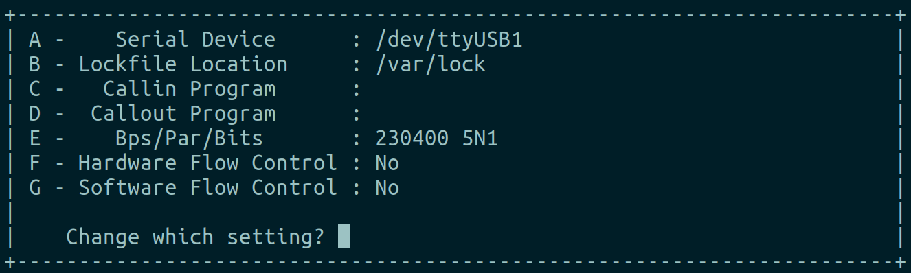
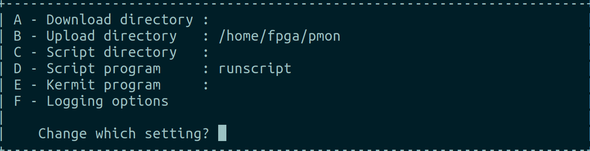
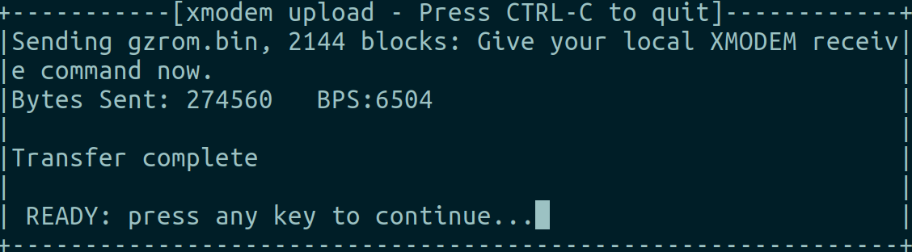
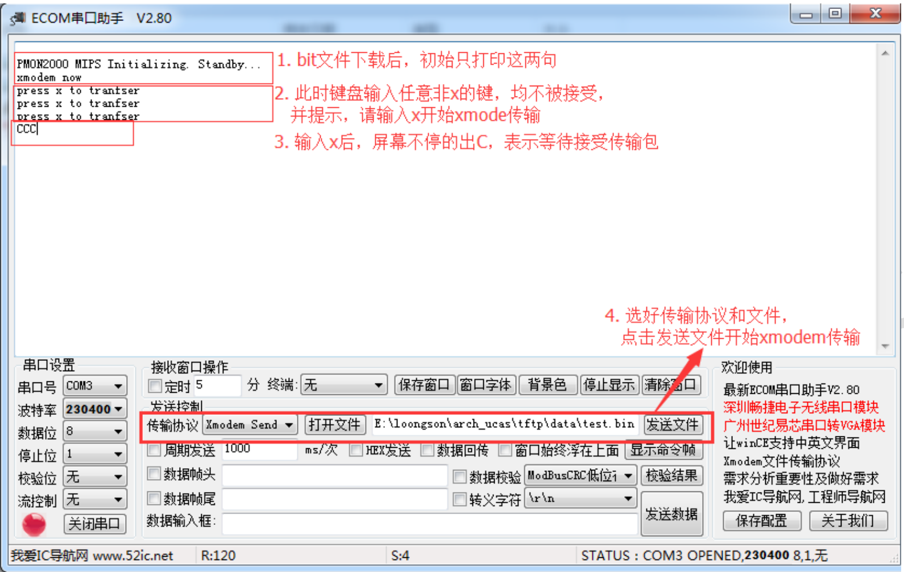
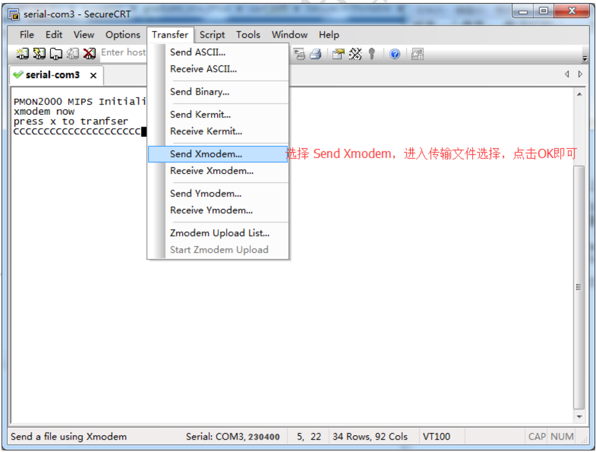

# 串口烧写flash说明
现有一个使用 gcc 编译好的 binary 文件(后缀名为.bin)，准备使用串口将其下载至 FPGA 上的 flash 芯片中。

## 准备工具
- FPGA开发板。
- FPGA电源线。
- FPGA下载线。
- flash芯片。
- 串口线。
- vivado。
- 串口软件（[ECOM](https://gitee.com/chenzes/chiplab-tools/releases/download/chiplab-tools/ECOMV280.zip)或[SecureCRT](https://gitee.com/chenzes/chiplab-tools/releases/download/chiplab-tools/SecureCRTPortable.zip)）

## 烧写步骤
1. flash 芯片正确放置 FPGA 开发板上。
2. FPGA 开发板与电脑连接下载线、串口线。
3. 电脑上打开 Vivado 工具中的 Open Hardware Manager，打开串口软件。
4. FPGA 板上电，如正常下载 bit 流文件一样下载 [programmer_by_uart.bit](https://gitee.com/chenzes/chiplab-tools/releases/download/chiplab-tools/programmer_by_uart.bit) 至 FPGA 上。
5. 串口软件，波特率选为 230400。
6. 串口连接正常后根据提示，键盘输入 x 表示开始 xmodem 传输。
7. 串口软件使用 xmodem 模式传输 binary 文件。
8. 等待传输完成。

## 串口软件使用
### minicom 烧写 flash 的步骤
终端输入
```
minicom -s
```
选择Serial port setup完成Serial device和Bps/Par/Bits的设置

选择Filenames and paths完成Upload directory的设置

于串口通讯界面，键盘输入x表示准备接受文件。    
`CTRL-A + s`，选择xmodem，空格选择需要传输的文件，回车启动传输，出现以下界面表示传输完成。

### ECOM 软件烧写 flash 的步骤

### SecureCRT 软件烧写 flash 的步骤
