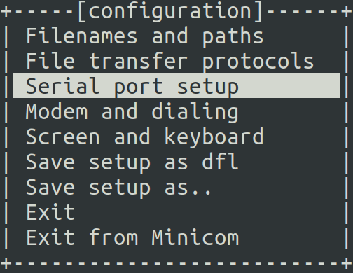
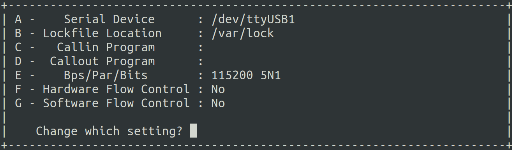
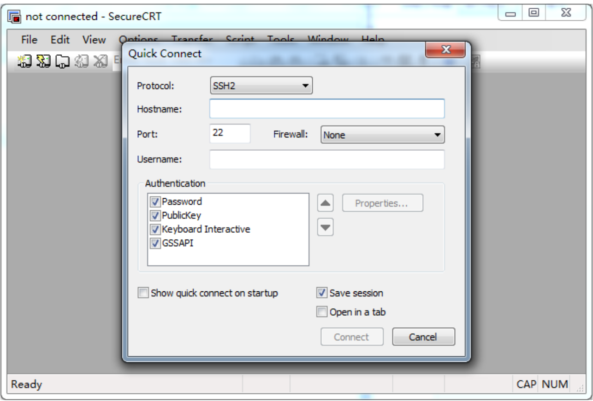
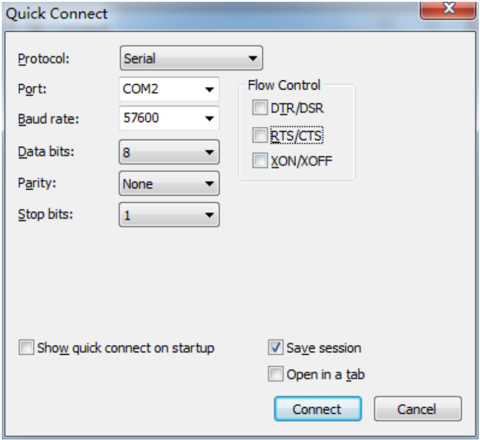
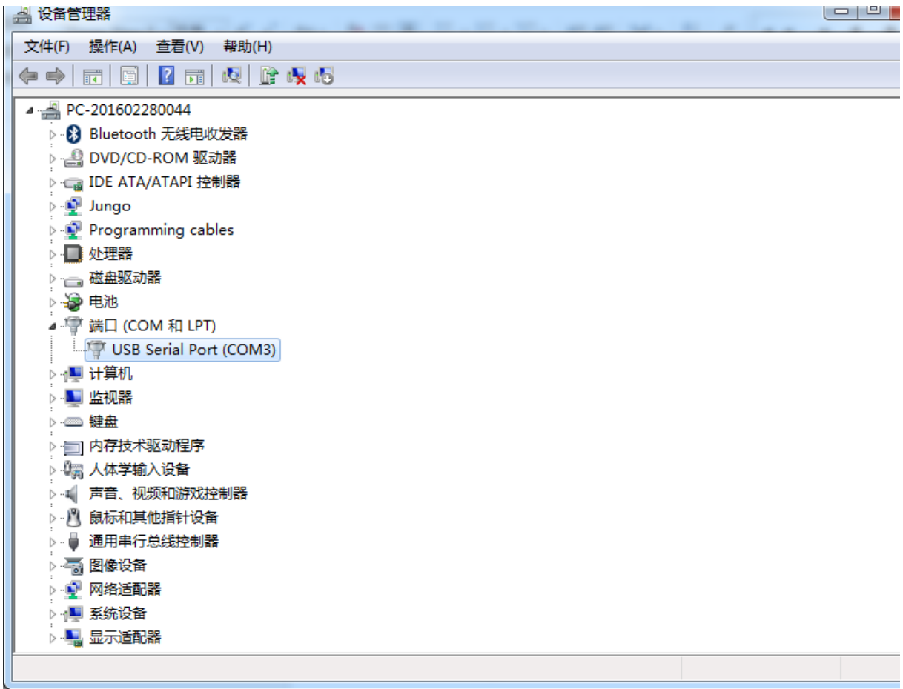
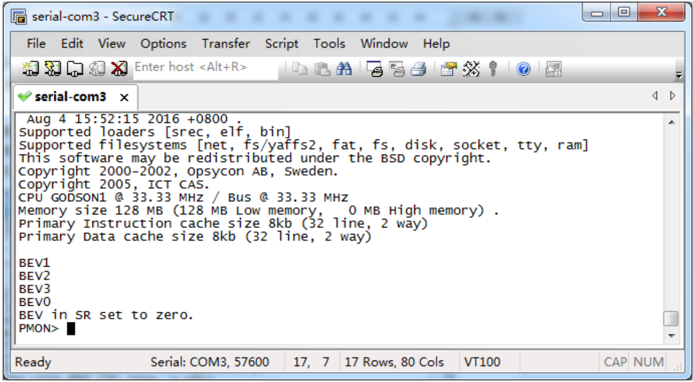
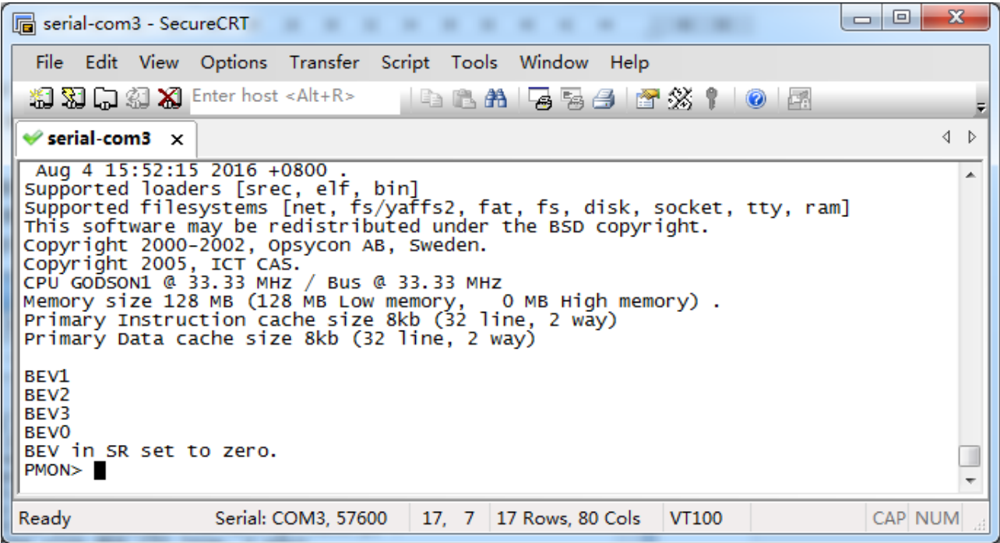
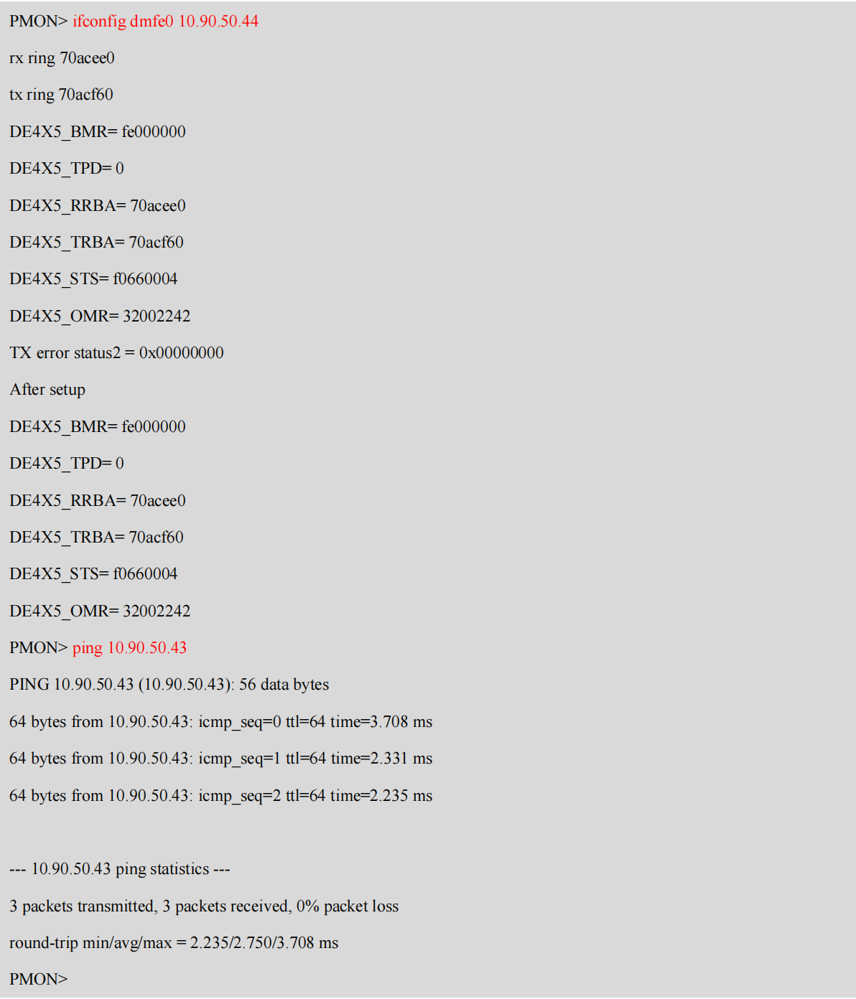
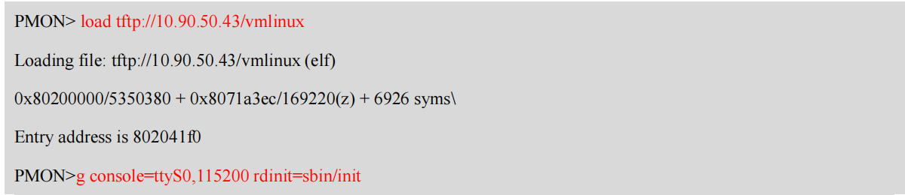
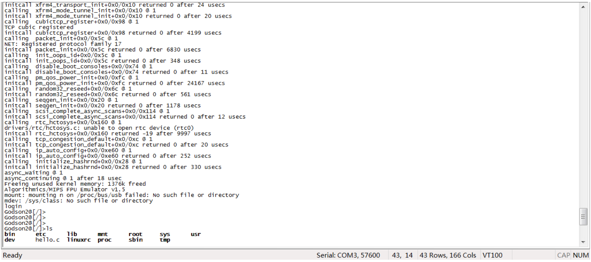

# PMON 运行并 load 内核启动的方法
内核启动需要依次完成以下步骤：
- 烧写 PMON 文件（[gzrom.bin](https://gitee.com/chenzes/chiplab-tools/releases/download/chiplab-tools/gzrom.bin)）到可插拔 SPI flash 上。
- 下载 bit 流文件。
- 运行 PMON。
- 搭建 tftp 服务器 Load 内核(vmlinux)。
- 启动内核。
    
## 烧写PMON
使用基于龙芯实验箱的串口编程flash的bit流文件，该bit流文件为一个简易SoC，可实现通过串口在线编程flash芯片。编程过程中，不需要拔下flash芯片，且速率达到6KB/sec。具体使用方法参考[串口烧写flash说明](./flash.md)

## 下载bit流文件
将开发板与主机间的下载线连接好，开发板上电，使用 Vavidao 工具里的 Open Hardware Manager 下载
bit 文件到开发板上。
## 运行PMON
上述烧写的 PMON 运行在下载的 SoC 上，需要使用串口展示运行信息。
将开发板与主机间的串口线连接好，打开串口软件，波特率设置为 115200。
### 串口软件
#### Linux下
##### 配置
终端下运行：
```
minicom -s
```
选择Serial port setup：    
     
进入配置界面：        

其中 E 行依据开发板上串口控制器的初始化代码中设置的波特率进行选择，F 和 G 行选择 NO。配置完成后按 Enter 返回，选择 Save setup as dfl 保存为默认设置。
##### 运行
将 USB 转串口一端连到电脑上，一端连到串口线上，串口线另一端连接到开发板上串口接口上。在Linux终端运行如下命令，开启电脑上的串口界面，开发板即可与电脑进行交换了。
```
sudo minicom
```
#### Windows下
Windows下可以使用免安装的[SecureCRTPortable串口软件](https://gitee.com/chenzes/chiplab-tools/releases/download/chiplab-tools/SecureCRTPortable.zip)。 先使用 USB 转串口和串口连接线将电脑和开发板相连。   
双击程序打开，第一次启动界面如下：

第一行 Protocol 下拉选择 Serial，如下：

其中 Baud rate 为选择波特率，需根据开发板上串口控制器的初始化代码中设置的波特率进行选择(对于本次校验设备，波特率需选择 115200)。右侧 Flow Control 全不选。Port 的选择需根据 Windows 电脑上的端口进行选择，可以右键电脑选择设备管理器进入设备管理器查看：

配置好串口后，点击 connect，即可进入串口界面，在波特率设置正确的情况下，可以通过串口与开发板进行交互，如下：

### PMON命令
连接上串口，打开串口软件，设置好波特率，则可以在串口窗口中看到 PMON 运行信息，运行成功后则会进入 PMON 提示符，此时可以输入 PMON 命令。

比如， SoC 中具有 MAC 控制器，PMON 中也有 MAC 驱动，则我们输入命令
```
ifconfig dmfe0 10.90.50.44
```
则可以给开发板上的网卡配置 IP 为 10.90.50.44（具体需配置的 IP 请查阅同网段的电脑 IP），假设同网段的电脑 IP 为 10.90.50.43,则可以继续输入命令
```
ping 10.90.50.43
```
用于查看网络是否成功接入。Linux
在 ping 网络是会一直发 ping 包，可以 `Ctrl+C` 取消 ping。运行结果如下：


## 运行Linux
由于运行 linux 时，最初的内核需要使用网口 load 进入内存执行，因而需要先搭建 Tftp 服务器。   
具体方法参见[tftp下载地址](https://gitee.com/chenzes/chiplab-tools/releases/download/chiplab-tools/tftp.zip)。    
目前运行 Linux 的方法是，先运行 PMON，随后通过网口 load Linux 内核进入 FPGA 上的 DDR3 内存上。在load内核前，需要通过以下命令裁剪掉内核二进制文件中的符号信息。
```
loongarch32r-linux-gnusf-strip vmlinux
```
load 命令为
```
load tftp://10.90.50.43/vmlinux
```
其中 10.90.50.43 为搭建的 tftp 服务器的 IP。    
串口的波特率为 115200。     
具体过程如下：    
启动 PMON 后，输入命令
```
ifconfig dmfe0 10.90.50.44
```
给开发板上的网卡配置 IP 为 10.90.50.44（具体需
配置的 IP 请查阅同网段的电脑 IP），假设同网段的电脑 IP 为 10.90.50.43, 则可以继续输入命令
```
ping 10.90.50.43
```
用于查看网络是否成功接入。      
网络配置好了，需要通过网络下载 Linux 内核，需要先搭建好 tftp 服务器，假设搭建的 tftp 服务器 IP
为 10.90.50.43，将要下载 Linux 内核放到 tftp 服务器的根目录下，输入命令
```
load tftp://10.90.50.43/vmlinux
```
即可 load 内核进入 FPGA 上的内存。

上表中显示 load 成功了，输入命令
```
g console=ttyS0,baudrate rdinit=sbin/init
```
即可运行该内核，命令中 baudrate 需为数字，即为串口控制器设置的波特率，设置不对时，串口显示字符为乱码。Linux 内核运行时波特率为 115200。    
当运行 Linux 内核成功后会出现`/ #`提示符，可以使用常用的 Linux 命令。
## 加载内存到 NandFlash
当前 SoC 支持 128MB的 NandFlash 作为电脑中的硬盘功能。因而可以将 Linux 内核加载到NandFlash
上。    
如果将内核加载至 NandFlash 中，且 PMON 中设置好参数。则复位实验箱后，会先自动运行 PMON 对设备进行初始化，随后 PMON 会自动加载 NandFlash 中的 Linux 内核进行启动，这就是通常电脑启动的过程。        
Linux 内核加载至 NandFlash 中并配置 PMON 的方法如下：    
1. 实验箱运行至 PMON；
2. 擦除 NandFlash，PMON 命令：    
```
mtd_erase /dev/mtd0r
mtd_erase /dev/mtd1r
```
3. 设置网口 IP，PMON 命令：
```
ifconfig dmfe0 x.x.x.x   
# x.x.x.x 为配置的 IP
```
4. 拷贝内核文件，PMON 命令：
```
devcp tftp://x.x.x.x /vmlinux /dev/mtd0
# x.x.x.x 为搭建的 tftp 服务器的 IP
```
如果传输过程中卡顿了，请按 `Ctrl+C` 取消本次传输后，在输入上述命令开始传输。如果多次取消
后，依然传输失败，请复位开发板后重新来过。    
如果 devcp 命令报错了 Exception，请复位开发板后重新来过。
5. 设置分区空间大小，PMON 命令：
```
set mtdparts nand-flash:50M@0(kernel)ro,-(rootfs)
```
如果出现 warning，不用管。
6. 设置启动分区及参数，PMON 命令：
```
set al /dev/mtd0
set append "console=ttyS0,115200 rdinit=/sbin/init initcall_debug=1 loglevel=20"
```
7. 重启 FPGA 实验箱，会自动完成本章开头描述的启动过程，自动运行到 Linux 内核状态：
