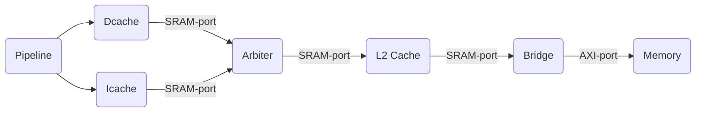
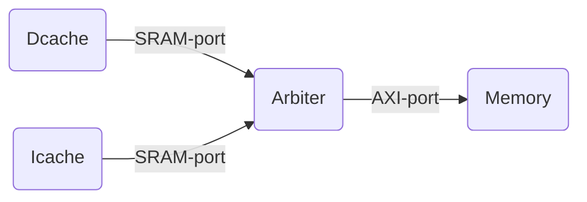
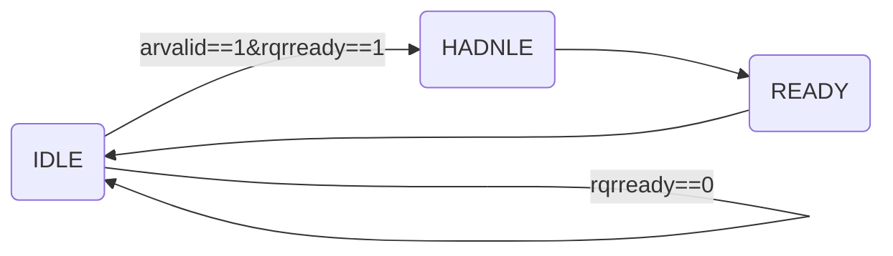
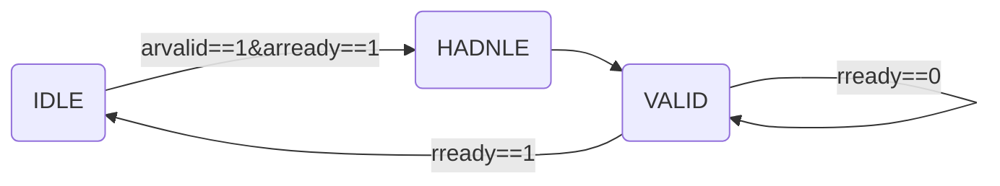
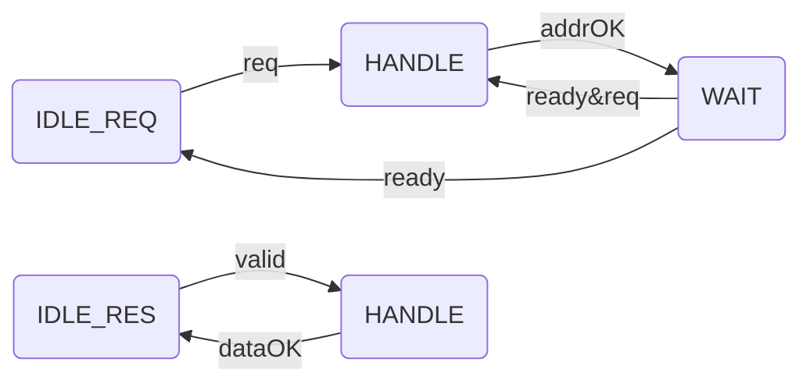
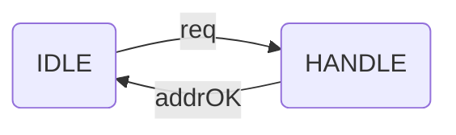

## 总体思路
预期：


其中，Aribiter负责仲裁Dcache与Icache的请求，并发送给L2 cache; Bridge负责将SRAM接口转换为AXI接口。
由于 Icache,Dcache 同时缺失的概率不大，故我们可以将Arbiter用简单的并行接受，串行转发的形式实现。当然，我们也会尝试设计将 L2 cache 和Arbiter耦合的版本，将请求通道和相应通道分离并行。
关于Bridge，我们无需考虑仲裁问题，因为L2 cache 串行发送请求给Mem。只需要考虑如何将SRAM接口转换为AXI接口即可，是否并行可以再讨论。

初步思路：


## SRAM-AXI-Bridge
### 读写并行模型
#### 读
主端
```mermaid
graph LR

```

从端
```mermaid
graph LR

```

### 全并行模型
要求：
要求实现读读并发（目前主要是IR与DR），读写并发（写缓冲导致），写写并发（写缓冲导致），读写不互斥（目前主要是IR与DW），写写不互斥（因为有预写序列）。
为实现要求，将通道严格细分：读请求、读响应、写请求、写数据、写响应，每个通道都有自己的状态机，且状态机之间不互斥，但是状态机内部的状态互斥。
**注意！需要在关联的通道间添加握手**
#### 读

**读请求**
主端：
？？？
从端：

|        |IDLE|HANDLE|READY|
|-|-|-|-|
|arready |0|0|1|
|rqrvalid|1|0|0|
**读响应**
主端：
？？？
从端：


#### 写


#### GENERAL
**请求响应分离**

valid=1:WAIT
ready=1:IDLE_RES
若不停顿，全流程4个周期
**不分离**

若不停顿，全流程3个周期
## 类SRAM接口
### 设计预案
#### Dcache
**size**
0:1 byte,1:2 byte,2:4 byte 
后期可以考虑加入8
当 cache 发出写/读请求，需要指定 size
返回数据一般用 size=4 (返回一整line)
**ok**
|       |读             |写|
|-|-|-|
|addr_ok|地址被接收      |数据返回|
|data_ok|地址和数据被接收|数据写入完成|

读请求：先后接收到addr_ok和data_ok后流出
写请求：接收到addr_ok后流出

#### Icache

#### 结构
写入时有写buffer，由转接桥管理，当buffer满时便会阻塞addr_ok以阻塞命令，直到buffer空出；读取时，同时在buffer与总线中搜索。

#### 问题
由于同时接受Icache与Dcache的请求，需要2端口吗？
从方发出的addr_ok信号不能依赖于req信号，Why?防止死锁？
req=1且addr_ok=0时，允许更改wr,size,addr,wstrb,wdata.Why?且为什么允许?与AXI有什么不同?

#### 

