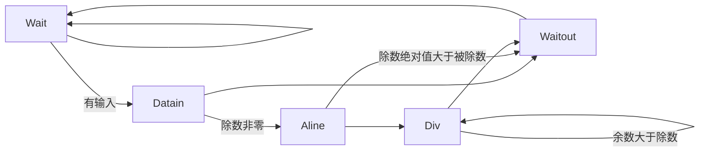

# NSCSCC2023 LoongArch团体赛

### 中国科学技术大学2队 Crepper 2023.8

## 成员

来泽远 曹宸瑞 徐航宇 徐翊然

## 设计简介

我们设计的 CPU 采用顺序双发射八级流水，实现了 63 条指令、26 种 CSR 寄存器、16 种例外。采用 AXI-4 总线。使用 2 路组相联 16KB icache 和；2 路组相联 16KB dcache，采用写直达，非写分配策略；8 路组相联L2cache，采用写回、写分配策略。使用分支预测器以减少分支失败带来的性能损失。

### 指令列表

| 指令名称  |  ISA 指令类型  | 微结构指令类型 |
| :-------: | :------------: | :------------: |
| RDCNTID.W |  其他杂项指令  |      ALU       |
| RDCNTVL.W |  其他杂项指令  |      ALU       |
| RDCNTVH.W |  其他杂项指令  |      ALU       |
|   ADD.W   | 算术运算类指令 |      ALU       |
|   SUB.W   | 算术运算类指令 |      ALU       |
|    SLT    | 算术运算类指令 |      ALU       |
|   SLTU    | 算术运算类指令 |      ALU       |
|    NOR    | 算术运算类指令 |      ALU       |
|    AND    | 算术运算类指令 |      ALU       |
|    OR     | 算术运算类指令 |      ALU       |
|    XOR    | 算术运算类指令 |      ALU       |
|   SLL.W   | 移位运算类指令 |      ALU       |
|   SRL.W   | 移位运算类指令 |      ALU       |
|   SRA.W   | 移位运算类指令 |      ALU       |
|   MUL.W   | 算术运算类指令 |      MUL       |
|  MULH.W   | 算术运算类指令 |      MUL       |
|  MULH.WU  | 算术运算类指令 |      MUL       |
|   DIV.W   | 算术运算类指令 |      DIV       |
|   MOD.W   | 算术运算类指令 |      DIV       |
|  DIV.WU   | 算术运算类指令 |      DIV       |
|  MOD.WU   | 算术运算类指令 |      DIV       |
|   BREAK   |  其他杂项指令  |      PRIV      |
|  SYSCALL  |  其他杂项指令  |      PRIV      |
|  SLLI.W   | 移位运算类指令 |      ALU       |
|  SRLI.W   | 移位运算类指令 |      ALU       |
|  SRAI.W   | 移位运算类指令 |      ALU       |
|   SLTI    | 算术运算类指令 |      ALU       |
|   SLTUI   | 算术运算类指令 |      ALU       |
|  ADDI.W   | 算术运算类指令 |      ALU       |
|   ANDI    | 算术运算类指令 |      ALU       |
|    ORI    | 算术运算类指令 |      ALU       |
|   XORI    | 算术运算类指令 |      ALU       |
|   CSRRD   |  CSR 访问指令  |      PRIV      |
|   CSRWR   |  CSR 访问指令  |      PRIV      |
|  CSRXCHG  |  CSR 访问指令  |      PRIV      |
|   CACOP   | Cache 维护指令 |     CACHE      |
|   ERTN    |  其他杂项指令  |      PRIV      |
|   IDLE    |  其他杂项指令  |      PRIV      |
|  LU12I.W  | 算术运算类指令 |      ALU       |
| PCADDU12I | 算术运算类指令 |      ALU       |
|   LL.W    |  原子访存指令  |      MEM       |
|   SC.W    |  原子访存指令  |      MEM       |
|   LD.B    |  普通访存指令  |      MEM       |
|   LD.H    |  普通访存指令  |      MEM       |
|   LD.W    |  普通访存指令  |      MEM       |
|   ST.B    |  普通访存指令  |      MEM       |
|   ST.H    |  普通访存指令  |      MEM       |
|   ST.W    |  普通访存指令  |      MEM       |
|   LD.BU   |  普通访存指令  |      MEM       |
|   LD.HU   |  普通访存指令  |      MEM       |
|   PRELD   |  普通访存指令  |      MEM       |
|   DBAR    |    栅障指令    |     CACHE      |
|   IBAR    |    栅障指令    |     CACHE      |
|   JIRL    |    转移指令    |       BR       |
|     B     |    转移指令    |       BR       |
|    BL     |    转移指令    |       BR       |
|    BEQ    |    转移指令    |       BR       |
|    BNE    |    转移指令    |       BR       |
|    BLT    |    转移指令    |       BR       |
|    BGE    |    转移指令    |       BR       |
|   BLTU    |    转移指令    |       BR       |
|   BGEU    |    转移指令    |       BR       |

### CSR寄存器列表

|    地址     |    名称     |
| :---------: | :---------: |
|     0x0     |    CRMD     |
|     0x1     |    PRMD     |
|     0x2     |    EUEN     |
|     0x4     |    ECFG     |
|     0x5     |    ESTAT    |
|     0x6     |     ERA     |
|     0x7     |    BADV     |
|     0xC     |   EENTRY    |
|    0x10     |   TLBIDX    |
|    0x11     |   TLBEHI    |
|    0x12     |   TLBELO0   |
|    0x13     |   TLBELO1   |
|    0x18     |    ASID     |
|    0x19     |    PGDL     |
|    0x1A     |    PGDH     |
|    0x1B     |     PGD     |
|    0x20     |    CPUID    |
|  0x30~0x33  | SAVE0~SAVE3 |
|    0x40     |     TID     |
|    0x41     |    TCFG     |
|    0x42     |    TVAL     |
|    0x44     |    TICLR    |
|    0x60     |   LLBCTL    |
|    0x88     |  TLBRENTRY  |
|    0x98     |    CTAG     |
| 0x180~0x181 |  DMW0~DMW1  |

### 例外列表

| Ecode | EsubCode | 例外代号 |
| :---: | :------: | :------: |
|  0x0  |    0     |   INT    |
|  0x1  |    0     |   PIL    |
|  0x2  |    0     |   PIS    |
|  0x3  |    0     |   PIF    |
|  0x4  |    0     |   PME    |
|  0x7  |    0     |   PPI    |
|  0x8  |    0     |   ADEF   |
|  0x8  |    1     |   ADEM   |
|  0x9  |    0     |   ALE    |
|  0xB  |    0     |   SYS    |
|  0xC  |    0     |   BRK    |
|  0xD  |    0     |   INE    |
|  0xE  |    0     |   IPE    |
|  0xF  |    0     |   FPD    |
| 0x12  |    0     |   FPE    |
| 0x3F  |    0     |   TLBR   |

## 流水线功能设计

CPU 采用顺序双发射八级流水结构，流水线分为 IF0、IF1、FIFO、ID、REG、EXE0、EXE1、WB 八级。

图中， AXI interconnect 借鉴了以 MIT license 分发的 verilog-axi 并大幅修改、所有BRAM生成代码均使用xilinx标准生成代码以增加灵活性，其余所有模块都由我们独立实现。

## 执行单元设计

执行单元采用双发射形式：

- 一路为全能单元，可以执行全部指令，在指令到达时将其放入 ALU, BR, DIV, PRIV, MUL, DCache, RDCNT 执行路径之一或之二。
- 另一路仅可执行 ALU, BR, MUL, RDCNT 指令。

### Dispatcher

处理数据相关与 Load and Use 等相关，与前递模块一同保证发送出的指令不会使用错误数据，同时返回发送信息使FIFO队列移位。

### ALU

ALU 单元可以执行 ADD.W、SUB.W、SLT、SLTU、AND、OR、NOR、XOR、SLL.W、SRL.W、SRA.W、SLLI.W、SRLI.W、SRAI.W、SLTI、SLTUI、ADDI.W、ANDI、ORI、XORI、LU12I.W、PCADDU12I 共 22 种运算。在得到运算结果后，向后空流水一级，以便与两级流水的运算单元补齐。

### BR

BR 单元可以执行 JIRL、B、BL、BEQ、BNE、BLT、BGE、BLTU、BGEU 共 9 种分支指令，并对分支预测结果进行检验。下一条指令方向的 PC 与跳转方向不一致时，选择刷新单条指令或刷新整条流水线。第一阶段仅进行 ALU 运算，第二周期发出反馈，以缩短关键路径。

### DIV

DIV 单元可以执行 DIV.W、MOD.W、DIV.WU、MOD.WU 共 4 种除法指令。采用提前开始方式，既多花费一个周期比较除数与被除数的位数差，达到减少除法周期的目的。使用状态机控制，当进行除法时，将流水线阻塞。而且在除数为0时结果输出0，同时不进入除法状态，以节约周期及防止流水线阻塞。为了优化前递路径，增加了一输入状态及输出状态，不做除数据传输外的其他工作，同时stall信号仅与内部状态有关。最后，在收到stall时若内部在做除法则继续除法，不响应stall，stall仅确保在等待态时不会进入其他态，以此节约时间。状态机如下：

### CSR_control

单元采取流水化访问，在第一周期读CSR寄存器，第二周期写CSR寄存器。但是由于CSR与取指阶段的例外、正确性密切相关，因此一旦修改CSR就一定冲刷流水线。同时留下接口，为之后实现MMU准备。（实际上已经实现了所有TLB相关指令并可两周期完成，但初赛不要求所以TLB没有放入）

### MMU

初赛仅要求实现DMW及直接地址映射，故实现了简单的MMU，对输入虚地址作简单比较后直接输出实地址，但保留报ADEM,ADEF的能力。

### MUL

MUL采用拆分乘法，将输入32位数拆分为两个16位数分别相乘，同时考虑符号后输出结果，这样可以充分简化设计，同时乘法器不在关键路径上。数学原理为：

$$
(2^{16}a+b)(2^{16}c+d)=2^{32}ac+2^{16}(bc+ad)+bd
\\-2^{32}(a[15](2^{16}c+d)+c[15](2^{16}a+b))
$$

其中最后减项仅在计算MULW时生效，a[15]，c[15]表示输入数符号位

## 分支预测器设计

## 预取单元设计

## 高速缓存设计

### L1指令缓存

- 基本参数
  - 数据总大小：8KB
  - 路数：2 路组相连
  - 单路行数： 128 行
  - 单行大小： 32 字节
  - 替换算法： LRU
- 控制逻辑

### L1数据缓存

- 基本参数
  - 数据总大小：8KB
  - 路数：2 路组相连
  - 单路行数： 128 行
  - 单行大小： 32 字节
  - 替换算法： LRU
- 控制逻辑

### L2混合缓存

- 基本参数
  - 数据总大小：64KB
  - 路数：8 路组相连
  - 单路行数： 128 行
  - 单行大小： 32 字节
  - 替换算法：tree-PLRU
- 控制逻辑

## 性能测试

| 序号              | 测试程序        | myCPU           | openla500 | T~openla500~/T~mycpu~ |
| ----------------- | --------------- | --------------- | --------- | --------------------- |
| cpu_clk : sys_clk | 70MHz  : 100MHz | 50MHz  : 100MHz |           |                       |
| 1                 | bitcount        | 6c350           | AAC96     | 1.57833201            |
| 2                 | bubble_sort     | 244e22          | 30357A    | 1.327878223           |
| 3                 | coremark        | 573f6b          | 8873DC    | 1.563967123           |
| 4                 | crc32           | 43d603          | 66390E    | 1.506912186           |
| 5                 | dhrystone       | 193b2b          | 128D5E    | 0.735290863           |
| 6                 | quick_sort      | 262ee2          | 33F846    | 1.361067308           |
| 7                 | select_sort     | 1f7f52          | 1FB806    | 1.00703223            |
| 8                 | sha             | 24cc6c          | 39F4A6    | 1.574945224           |
| 9                 | stream_copy     | 1ebcc           | 37340     | 1.795965052           |
| 10                | stringsearch    | 34d9e7          | 29ABEE    | 0.788470561           |
