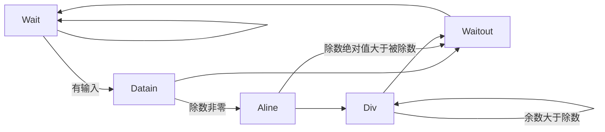

# NSCSCC2023 LoongArch团体赛

> 中国科学技术大学2队 Crepper 2023.8

## 成员

来泽远  曹宸瑞  徐航宇  徐翊然

## 设计简介

我们设计的 CPU 采用顺序双发射八级流水，实现了 63 条指令、26 种 CSR 寄存器、16 种例外[^0]。采用 AXI-4 总线。使用 2 路组相联 16KB Icache 和 2 路组相联 16KB Dcache，采用写直达，非写分配策略；8 路组相联L2cache，采用写回、写分配策略。使用二级流水的分支预测器以减少分支失败带来的性能损失。为L2 Cache适配了IPCP预取[^7]，以提高L2 Cache的命中率。

### 指令列表

| 指令名称  |  ISA 指令类型  | 微结构指令类型 |
| :-------: | :------------: | :------------: |
| RDCNTID.W |  其他杂项指令  |      ALU       |
| RDCNTVL.W |  其他杂项指令  |      ALU       |
| RDCNTVH.W |  其他杂项指令  |      ALU       |
|   ADD.W   | 算术运算类指令 |      ALU       |
|   SUB.W   | 算术运算类指令 |      ALU       |
|    SLT    | 算术运算类指令 |      ALU       |
|   SLTU    | 算术运算类指令 |      ALU       |
|    NOR    | 算术运算类指令 |      ALU       |
|    AND    | 算术运算类指令 |      ALU       |
|    OR     | 算术运算类指令 |      ALU       |
|    XOR    | 算术运算类指令 |      ALU       |
|   SLL.W   | 移位运算类指令 |      ALU       |
|   SRL.W   | 移位运算类指令 |      ALU       |
|   SRA.W   | 移位运算类指令 |      ALU       |
|   MUL.W   | 算术运算类指令 |      MUL       |
|  MULH.W   | 算术运算类指令 |      MUL       |
|  MULH.WU  | 算术运算类指令 |      MUL       |
|   DIV.W   | 算术运算类指令 |      DIV       |
|   MOD.W   | 算术运算类指令 |      DIV       |
|  DIV.WU   | 算术运算类指令 |      DIV       |
|  MOD.WU   | 算术运算类指令 |      DIV       |
|   BREAK   |  其他杂项指令  |      PRIV      |
|  SYSCALL  |  其他杂项指令  |      PRIV      |
|  SLLI.W   | 移位运算类指令 |      ALU       |
|  SRLI.W   | 移位运算类指令 |      ALU       |
|  SRAI.W   | 移位运算类指令 |      ALU       |
|   SLTI    | 算术运算类指令 |      ALU       |
|   SLTUI   | 算术运算类指令 |      ALU       |
|  ADDI.W   | 算术运算类指令 |      ALU       |
|   ANDI    | 算术运算类指令 |      ALU       |
|    ORI    | 算术运算类指令 |      ALU       |
|   XORI    | 算术运算类指令 |      ALU       |
|   CSRRD   |  CSR 访问指令  |      PRIV      |
|   CSRWR   |  CSR 访问指令  |      PRIV      |
|  CSRXCHG  |  CSR 访问指令  |      PRIV      |
|   CACOP   | Cache 维护指令 |     CACHE      |
|   ERTN    |  其他杂项指令  |      PRIV      |
|   IDLE    |  其他杂项指令  |      PRIV      |
|  LU12I.W  | 算术运算类指令 |      ALU       |
| PCADDU12I | 算术运算类指令 |      ALU       |
|   LL.W    |  原子访存指令  |      MEM       |
|   SC.W    |  原子访存指令  |      MEM       |
|   LD.B    |  普通访存指令  |      MEM       |
|   LD.H    |  普通访存指令  |      MEM       |
|   LD.W    |  普通访存指令  |      MEM       |
|   ST.B    |  普通访存指令  |      MEM       |
|   ST.H    |  普通访存指令  |      MEM       |
|   ST.W    |  普通访存指令  |      MEM       |
|   LD.BU   |  普通访存指令  |      MEM       |
|   LD.HU   |  普通访存指令  |      MEM       |
|   PRELD   |  普通访存指令  |      MEM       |
|   DBAR    |    栅障指令    |     CACHE      |
|   IBAR    |    栅障指令    |     CACHE      |
|   JIRL    |    转移指令    |       BR       |
|     B     |    转移指令    |       BR       |
|    BL     |    转移指令    |       BR       |
|    BEQ    |    转移指令    |       BR       |
|    BNE    |    转移指令    |       BR       |
|    BLT    |    转移指令    |       BR       |
|    BGE    |    转移指令    |       BR       |
|   BLTU    |    转移指令    |       BR       |
|   BGEU    |    转移指令    |       BR       |

### CSR寄存器列表

|    地址     |    名称     |
| :---------: | :---------: |
|     0x0     |    CRMD     |
|     0x1     |    PRMD     |
|     0x2     |    EUEN     |
|     0x4     |    ECFG     |
|     0x5     |    ESTAT    |
|     0x6     |     ERA     |
|     0x7     |    BADV     |
|     0xC     |   EENTRY    |
|    0x10     |   TLBIDX    |
|    0x11     |   TLBEHI    |
|    0x12     |   TLBELO0   |
|    0x13     |   TLBELO1   |
|    0x18     |    ASID     |
|    0x19     |    PGDL     |
|    0x1A     |    PGDH     |
|    0x1B     |     PGD     |
|    0x20     |    CPUID    |
|  0x30~0x33  | SAVE0~SAVE3 |
|    0x40     |     TID     |
|    0x41     |    TCFG     |
|    0x42     |    TVAL     |
|    0x44     |    TICLR    |
|    0x60     |   LLBCTL    |
|    0x88     |  TLBRENTRY  |
|    0x98     |    CTAG     |
| 0x180~0x181 |  DMW0~DMW1  |

### 例外列表

| Ecode | EsubCode | 例外代号 |
| :---: | :------: | :------: |
|  0x0  |    0     |   INT    |
|  0x1  |    0     |   PIL    |
|  0x2  |    0     |   PIS    |
|  0x3  |    0     |   PIF    |
|  0x4  |    0     |   PME    |
|  0x7  |    0     |   PPI    |
|  0x8  |    0     |   ADEF   |
|  0x8  |    1     | ADEM[^1] |
|  0x9  |    0     |   ALE    |
|  0xB  |    0     |   SYS    |
|  0xC  |    0     |   BRK    |
|  0xD  |    0     |   INE    |
|  0xE  |    0     |   IPE    |
|  0xF  |    0     |   FPD    |
| 0x12  |    0     |   FPE    |
| 0x3F  |    0     |   TLBR   |

## 流水线功能设计

CPU 采用顺序双发射八级流水结构，流水线分为 IF0、IF1、FIFO、ID、REG、EXE0、EXE1、WB 八级。


图中， 除了 AXI interconnect 借鉴了以 MIT license 分发的 verilog-axi [^2]并修改、所有BRAM生成代码均使用 Xilinx 标准生成代码以增加灵活性，其余所有模块都由我们独立实现。


## 执行单元设计

执行单元采用双发射形式：

- 一路为全能单元，可以执行全部指令，在指令到达时将其放入 ALU, BR, DIV, PRIV, MUL, DCache, RDCNT 执行路径之一或之二。
- 另一路仅可执行 ALU, BR, MUL, RDCNT 指令。

### Fetch Buffer

采用 FIFO 队列，存储 ICache 发出的指令，并在 ICache 访问 AXI 总线时能持续发出存储的指令。

### Dispatcher

处理数据相关与 Load and Use 等相关，与前递模块一同保证发送出的指令不会使用错误数据，同时返回发送信息使FIFO队列移位。


### Arithmetic Logic Unit (ALU)

ALU 单元可以执行 ADD.W、SUB.W、SLT、SLTU、AND、OR、NOR、XOR、SLL.W、SRL.W、SRA.W、SLLI.W、SRLI.W、SRAI.W、SLTI、SLTUI、ADDI.W、ANDI、ORI、XORI、LU12I.W、PCADDU12I 共 22 种运算。在得到运算结果后，向后空流水一级，以便与两级流水的运算单元补齐。

### Branch Unit (BR)

BR 单元可以执行 JIRL、B、BL、BEQ、BNE、BLT、BGE、BLTU、BGEU 共 9 种分支指令，并对分支预测结果进行检验。下一条指令方向的 PC 与跳转方向不一致时，选择刷新单条指令或刷新整条流水线。第一阶段仅进行 ALU 运算，第二周期发出反馈，以缩短关键路径。


### Divider (DIV)

DIV 单元可以执行 DIV.W、MOD.W、DIV.WU、MOD.WU 共 4 种除法指令。采用提前开始方式，既多花费一个周期比较除数与被除数的位数差，达到减少除法周期的目的。使用状态机控制，当进行除法时，将流水线阻塞。而且在除数为0时结果输出0，同时不进入除法状态，以节约周期及防止流水线阻塞。为了优化前递路径，增加了一输入状态及输出状态，不做除数据传输外的其他工作，同时stall信号仅与内部状态有关。最后，在收到stall时若内部在做除法则继续除法，不响应stall，stall仅确保在等待态时不会进入其他态，以此节约时间。状态机如下：



### CSR Control

单元采取流水化访问，在第一周期读 CSR 寄存器，第二周期写 CSR 寄存器。但是由于 CSR 与取指阶段的例外、正确性密切相关，因此一旦修改 CSR 就一定冲刷流水线。同时留下接口，为之后实现 MMU 准备。（实际上已经实现了所有 TLB 相关指令并可两周期完成，但初赛不要求所以 TLB 没有放入）

### Memory Maping Unit (MMU)

初赛仅要求实现 DMW 及直接地址映射，故实现了简单的 MMU ，对输入虚地址作简单比较后直接输出实地址，但保留报 ADEM, ADEF 的能力。

### Multiplier (MUL)

MUL采用拆分乘法，将输入 32 位数拆分为两个 16 位数分别相乘，同时考虑符号后输出结果，这样可以充分简化设计，同时乘法器不在关键路径上。数学原理为：

$$
(2^{16}a+b)(2^{16}c+d)=2^{32}ac+2^{16}(bc+ad)+bd
\\-2^{32}(a[15](2^{16}c+d)+c[15](2^{16}a+b))
$$

其中最后减项仅在计算 MUL.W 时生效，a[15]，c[15]表示输入数符号位。

## 分支预测器设计
### 综述
由于本架构中流水级较多，冲洗流水线的代价较大，因此，我们配置了分支预测器，通过记录并分析分支指令的历史行为，以尝试对跳转指令进行预测，减少流水线冲洗次数，提高处理器性能。

由于本架构为双发射架构，因此每个周期取指单元均可取出两条指令。这对分支预测的设计产生了巨大挑战。考虑到连续的两条指令一般不会同时为跳转指令，我们选择了将连续两条指令捆绑预测的方式，但这也对流水线和更新单元提出了挑战。

为了降低分支预测查表与计算等带来的延迟对CPU主频的影响，我们采取了二级流水的分支预测，并使用 npc 进行预测，以减少组合查表对时序和布线的影响。

此外，考虑到不同类型的跳转指令的行为不同，适宜采取的预测策略也不同。因此，我们根据 pc 记录了指令类型，并对不同类型的指令采用了不同的预测模式。

我们的设计参考了《超标量处理器设计》[^3]，以及以[^5] [^6]为主的 preceptron , tage 等技术的相关论文。

### 基本原理与结构


我们设计的分支预测器主要由历史表、方向预测器、地址预测器、类别记录表等组成。主要尝试的新颖技术有：推测更新的全局历史队列、基于感知机(perceptron)的方向预测器[^5]、tage 混合预测模式[^6]等。

#### 历史表
* 局部历史表：
  * 预测：将 pc 哈希后，作为局部历史表的索引，从而得到该 pc 对应的历史记录。每个历史记录包含一个 16 位的历史记录。
  * 更新：每当指令有返回结果时，将该指令的 pc 哈希后，作为局部历史表的索引，从而得到该 pc 对应的历史记录。每个历史记录包含一个 16 位的历史记录。将该历史记录左移一位，将返回结果加入历史记录的最低位。
* 全局历史队列：
  * 我们采用推测更新的全局历史队列。以提高全局历史的更新及时性和准确率。
  * 预测：使用32位的 gh 寄存器，其存储着当前的全局历史信息，即过去32条分支指令的跳转情况。
  * 推测更新：每当分支预测器给出一条分支指令的跳转结果时，使用其对 gh 寄存器与断点队列进行更新：gh 左移并将预测结果加入最低位，将此时的 gh 最低位取反并加入断点恢复队列。
  * 断点恢复：当 ex 段返回一条分支预测指令的跳转情况时，如果预测正确，则将断点队列的指针减一；否则，将断点队列清空，并将 gh 寄存器恢复到断点队列指针对应的历史记录。

#### 方向预测器
* 基于 2bits 感知器的方向预测表bhpt：
  * 将 pc 与历史哈希后，作为方向预测器的索引，从而得到该 pc 对应的方向预测器记录。每个方向预测器记录包含一个 2bits 感知机 与 由 pc 的若干位宽组成的 tag 。tag 可以降低冲突对预测正确率的影响 。
  * 预测：基于 2bits 感知器对于分支的历史行为进行学习。当需要预测时，根据计数器的高位 bit 进行预测，如果高位为 1 ，则预测跳转，否则不跳转。
  * 更新：每当指令有返回结果时，如果指令跳转，则对这 2bits 加 1 ，如果此计数饱和（即达到了 11），则不做改变；反之，如果指令没有跳转，则对于这个计数器减 1 。
* perceptron：

  * 由权重表和点积单元组成。
  * 预测：将 pc 哈希后，作为权重表的索引，从而得到该 pc 对应的权重记录。将权重与历史做点积后，如果超过某个阈值，则预测跳转，否则预测不跳转。
  * 更新：当 ex 段传回分支指令的实际跳转结果后，若预测正确，则使用将其各位权重分别按照历史对应位的方向变化；否则按照历史对应位的相反方向变化。
  * 相对于 2bits 感知器，perceptron 可以更好地学习分支的历史行为，且前者更适合短历史，而后者更适合长历史。这是因为：前者将历史作为索引的一部分，对于长历史，只能牺牲精度使用哈希或者截断的方式进行索引，否则表的大小将呈几何级数的增长；而后者将历史作为索引，历史长度只会影响权重的位数，表的大小只会线性增长。此外，与前者各位历史地位均等不同，后者可以通过训练淡化较远历史的影响。（事实上，随着历史增长，前者的准确率最终会逐渐下降，而后者可以一直保持上升）
* TAGE：

  * 为了将局部历史和全局历史的预测有机结合，我们采用了 tage 的设计，如图。其性能相比 gshare 模式较优。
  * 预测：将pc和历史哈希后，作为索引，分别索引基础预测表、8位历史预测器、16位历史预测器、32位历史预测器，后三者用tag判断是否命中，并查询cnt位，判断是否为正，如果命中且正，则判断为有效。从四个预测器中有效的预测结果里，从右到左优先选出前两个，分别作为预测结果和备择结果；如果后三个预测器均无效，则选择基础预测器的预测结果。
  * 更新：
    * 当 ex 段传回的指令为分支指令时，若当初的预测与备择预测相同，则不更新cnt计数位；否则更新。更新时，如果预测成功，提供预测的预测器cnt加一；否则，减一。
    * 当整体预测错误时：如果比提供预测的预测器使用的历史更长的预测器中，存在cnt为0的预测器，则将按照实际结果初始化。如果不存在，则所有更长历史的预测器cnt减一。
#### 地址预测器
* 局部历史地址表btb：
  * 预测：将 pc 与局部历史哈希后，作为地址预测器的索引，从而得到该 pc 对应的跳转地址记录。
  * 更新：将 ex 段跳转指令在发生跳转时的跳转地址记录到 btb 中。
* 返回栈：
  * 预测：对于被预测为返回指令的 pc ，将栈顶出栈并作为跳转 pc 。
  * 更新：当 ex 段传回的指令被识别为函数调用时，其下一条指令的 pc 入栈，当 ex 段传回的指令被识别为返回指令时，若预测错误，则将栈清空，防止错误的更新污染栈内地址预测的有效性，影响正确性。
#### 类别记录表
* 类别记录表：
  * 将 pc 哈希后，作为类别记录表的索引，从而得到该 pc 对应的类别记录。每个类别记录包含一个 3 位的类别记录。该类别预测将被运用到预测分析器和全局历史、返回栈的推测更新中。
* 预测分析器：
  * 根据类别记录表得到的类别，对 pc 采用不同的预测策略。
  * 对于非跳转指令，忽略其他预测器的结果，不跳转。
  * 对于分支指令，如果方向预测器预测跳转，则采用地址预测器的预测结果，否则预测不跳转。
  * 对于返回指令，用 2bits 感知机选择使用地址预测器或返回栈的预测结果。
  * 对于其他跳转指令，预测跳转，并直接采用方向预测器的预测结果。

### 二级流水与使用npc预测
* 为了降低分支预测查表与计算等带来的延迟对CPU主频的影响，我们采取了二级流水的分支预测，并使用 npc 进行预测，以减少组合查表对时序和布线的影响。
* 在这种设计下，分支预测器内部，第一个周期接收npc，第三个周期送出预测的npc的下一个pc(nnpc)。从而分支预测可以使用两个周期进行预测，所有表项均可使用bram实现。
* 由于流水线需要等待两个周期才能得到预测的npc，于是，需要流水线先默认预测+4或+8，等到第二周期，才能将分支预测的结果与默认预测的结果进行比较，如果不同（即分支预测认为需要跳转），则刷洗前一段流水线，将pc更新为分支预测的跳转地址。
### 对双发射架构的适配
* 打包预测：由于我们的架构为双发射，一次需要预测两条指令才能满足发射队列的需求。因此，我们在预测时，将两条指令打包预测，即：pc 为偶数时，一并预测 pc 和 pc+1 的跳转行为；pc 为奇数时，只预测 pc 的跳转行为；并按优先级对合并指令的类型做分类。这样，pc 在下一周期很可能对齐，从而回到两条指令一起预测的状态。这种设计相对于 先后预测两条指令 降低了时间和空间消耗，但这也对流水线和更新单元提出了挑战。
* 流水线：当被打包预测的两条指令中，前一条是跳转指令，并且分支预测正确时，此时后一条指令为被误取的指令。流水线必须在此时刷洗这一条误取的指令，而不刷洗整条流水线（否则分支预测将失去一半的准确率）。
* 返回缓冲区：由于双发射流水线中，两条打包的指令可能并不会一同发射。我们采用返回预测区，将ex段返回的指令信息先放入缓冲区，先恢复原来的打包，再重新按优先级合并，送入预测单元用于更新。

### 性能与展望
* 性能：在chiplab的coremark测试程序中，有超过70%的预测准确率。可能因为coremark不太利好全局历史与长历史，或者我们架构限制了全局历史断点恢复的及时性，tage等技术带来的提升并不太大。
* 展望：未来，我们还可以进行以下优化：
  * 提高全局历史的推测更新效率，以应对分支指令扎堆造成的影响。
  * 利用verilator,chiplab等工具，编写cpp代码，对分支预测进行精准的调试。
  * 使用更多更有针对性的测试代码，以尝试查出分支预测潜在的bug或漏洞。
  * 尝试更多的预测设计与混合模式。
  * 为流水分支预测中流水线第一段的默认预测添加一个小预测器。

## 高速缓存设计

### 综述

本架构中配置L1cache和L2cache，旨在减小访存成本，减小cpu阻塞时间。

当流水线向L1cache发起一致可缓存类型访存时，需要一个周期用于查询，若命中可以直接返回数据，否则由L1cache向L2cache发起访存请求。L2cache也需要一个周期用于查询，如果命中则返回数据给L1cache，否则则通过sram协议向axi转接桥发起访存请求，再由转接桥通过axi协议向主存发起访存请求。

对于强序非缓存请求，则数据地址，访存类型通过cache一路直达axi，直至响应请求（读还需等待数据），cpu才可以解除阻塞。

L1cache均采用流水式访存，可以做到当cache连续命中时不阻塞流水线。考虑到cpu时钟频率的需求，为了限制最长路径，L2取消了流水能力，并且若访问命中，向Icache和Dcache的响应分别需要一个周期和两个周期。

### 一级指令缓存

- 基本参数
  - 数据总大小：8KB
  - 路数：2 路组相连
  - 单路行数： 128 行
  - 单行大小： 32 字节
  - 替换算法： LRU
  
- 控制逻辑

    ```mermaid
    graph LR
    A(IDLE)-->B(LOOKUP)-->C(Miss)-->B
    B-->B
    A-->D(Operation)-->B
    B-->D
    ```

    - IDLE：初始状态，收到流水线请求后进入对应状态。本架构中，Icache输入一直是有效的，不会回到Idle状态。
    - Lookup：查询状态。若命中则一次返回两条指令，否则进入Miss，向L2cache查询数据。
    - Miss：等待L2cache响应请求并且接收数据。
    - Operation：用于完成cacop和ibar操作。值得一提的是由于L2cache的存在，ibar指令的具体实现为无效Icache所有行。
    
- 对外交互逻辑

    - 流水线
        - Icache中不配置输入地址的valid位，默认为有效。通过ready信号标志发出数据有效，否则则阻塞流水线。发出一共64位的数据，为两条指令，低位为指定地址的指令，高位为其后的指令，并且通过flag位标志后一条指令是否有效。
        - 设置特殊的接口响应cache指令，并且通过ready信号与流水线通讯表示该指令已完成。

    - L2cache
        - 通过req信号，req信号置高期间，向下访存地址有效且不变。直至L2cache发出完成信号并且发出数据，Icache接收。L2cache向Icache发送的数据长度在一致可缓存时为Icache的cache line长度，强序非缓存时为低32位有效的数据。

### 一级数据缓存

- 基本参数
  - 数据总大小：8KB
  - 路数：2 路组相连
  - 单路行数： 128 行
  - 单行大小： 32 字节
  - 替换算法： LRU
  - 写策略：写直达、非写分配

- 控制逻辑

  ```mermaid
  graph LR
  A(IDLE)-->B(LOOKUP)-->C(Miss_r)-->B
  B-->B
  B-->A
  B-->E(Write)-->B
  A-->D(Operation)-->B
  B-->D
  ```

  - IDLE：初始状态，收到流水线请求后进入对应状态。
  - Lookup：查询状态。若命中则一次返回一个32的数据，否则进入Miss或者Write，向L2cache发起读请求或者写请求。
  - Write：由于写直达的设计，无论是否命中都需要向L2cache发起写请求。
  - Miss：等待L2cache响应请求并且接收数据。
  - Operation：用于完成cacop操作。

- 对外交互逻辑

  - 流水线
    - Dcache中配置输入地址的valid位。通过ready信号标志发出数据有效，否则则阻塞流水线。Dcache中不考虑访存的长度区分，均返回地址对齐的32位数据，交由对应单元截取所需数据与进行符号位拓展。
    - 设置特殊的接口响应cache指令，并且通过ready信号与流水线通讯表示该指令已完成。
  - L2cache
    - 读：通过req信号与读写类型标志位，req信号置高期间，向下访存地址有效且不变。直至L2cache发出完成信号并且发出数据，Dcache接收。L2cache向Dcache发送的数据长度在一致可缓存时为Dcache的cache line长度，强序非缓存时为低32位有效的数据。
    - 写：大体逻辑与读类似，不同在于Dcache不需要真正等到L2cache完成写操作，只需要确认L2cache接收了来自Dcache的请求便可以继续响应流水线其他的请求。

### 二级混合缓存

- 基本参数
  - 数据总大小：32KB
  - 路数：8 路组相连
  - 单路行数： 128 行
  - 单行大小： 32 字节
  - 替换算法：tree-PLRU
  - 写策略：写回、写分配

- 控制逻辑

  ```mermaid
  graph LR
  A(IDLE)-->B(LOOKUP)-->C(CheckDirty)
  C-->G
  C-->F(WriteBack)-->G(Read)
  B-->A
  G-->E(Write)-->A
  G-->A
  A-->D(Operation)-->A
  A-->H(Prefetch)-->A
  ```

  - IDLE：初始状态，收到流水线请求后进入对应状态。

  - Lookup：查询状态。若命中则一次返回一个L1cacheline大小的数据，否则无论是读写请求都需要先从主存中调块。

  - CheckDirty：从脏表中读取即将被替换的行，若脏则优先写回。
  - WriteBach：向AXI发起写请求，一次写一个L2cacheline大小的数据。

  - Read：向AXI发起读请求，一次请求一个L2cacheline大小的数据。

  - Write：若因为写不命中调块，则在调块完成后再进行一次写操作。
  - Operation：执行cacop，复用了一部分读写状态机，在上图中未展示。
  - Prefetch：L2cache支持数据预取，并且在此期间可以响应来自L1的且在L2中命中的请求。

- 对外交互逻辑

  - 流水线
    - 配置直接面向流水线的接口用于响应cache指令，通过flag标志是否要求L2cache执行一条cache指令。

  - L1cache
    - 通过addrOK响应写，dataOK响应读，并且由于L1cache的请求会被L2cache阻塞，L2响应时只需要发出一拍脉冲信号，必然可以被L1接收。
  - AXI
    - 经过写缓冲区和读缓冲区缓冲与转译后，通过 SRAM 握手协议向 AXI 转接桥发起访存[^4]。


### FIFO 写缓冲区
- 基本参数
  - 数据总大小：64KB
  - 单行数据大小： 32 字节
  - 队列大小：5

- 原理与优势
  由于我们的设计中， L1cache 的写策略为写直达，L2cache会频繁接受 L1cache 的写请求，且更易向 AXI 发出写请求。因此我们设计了一个写缓冲区，用于缓冲写请求，使得 L2cache可以在对AXI发出写请求时，不需要等待 AXI 的响应，从而减少了 L2cache 的阻塞时间，提高了整体性能。

## 性能测试

- 使用 Vivado 2019.2 综合与布线，时钟频率为 45MHz，拨上最左开关后，IPC比值为0.907，详细成绩如下：

| 序号 | 测试程序                         | myCPU                                         | myCPU                                         | myCPU                     | openla500                  | IPCmycpu/IPCgs132 |
| ---- | -------------------------------- | --------------------------------------------- | --------------------------------------------- | ------------------------- | -------------------------- | ----------------- |
|      | cpu_clk : sys_clk=45MHz : 100MHz | 数码管显示     (CPU count)     (最左开关拨下) | 数码管显示     (SoC count)     (最左开关拨上) | CPU count      : SoC cout | 数码管显示     (CPU count) |                   |
| 1    | bitcount                         | 4b135                                         | a6de3                                         | 0.449909362               | 000572e5                   | 1.161244061       |
| 2    | bubble_sort                      | 1b2191                                        | 3c4b0b                                        | 0.449986853               | 00180f6a                   | 0.886812349       |
| 3    | coremark                         | 3f67e0                                        | 8d99ab                                        | 0.447779964               | 0044469b                   | 1.076807545       |
| 4    | crc32                            | 2fcb23                                        | 6a363a                                        | 0.44998289                | 00331c68                   | 1.069412345       |
| 5    | dhrystone                        | 1183df                                        | 26ece1                                        | 0.449967444               | 000945fd                   | 0.529450609       |
| 6    | quick_sort                       | 17b7f8                                        | 34b5cd                                        | 0.449982095               | 0019fc53                   | 1.095579456       |
| 7    | select_sort                      | 17fc8d                                        | 354e7c                                        | 0.449973093               | 000fd4b8                   | 0.65999271        |
| 8    | sha                              | 19e785                                        | 399189                                        | 0.449974807               | 001cfda8                   | 1.119148668       |
| 9    | stream_copy                      | 14fe0                                         | 2eb36                                         | 0.44950493                | 0001bb30                   | 1.319501303       |
| 10   | stringsearch                     | 250ac1                                        | 525198                                        | 0.449982761               | 0014dc07                   | 0.563130436       |

## 操作系统与应用

### PMON

#### cache参数配置

path:`pmom/arch/loongarch32/cache.S:CPU_ConfigCache`

```assembly
LEAF(CPU_ConfigCache)
    li.w      t0, 32 
    la      t1, CpuPrimaryInstCacheLSize 
    st.w    t0, t1, 0  
    la      t1, CpuPrimaryDataCacheLSize 
    st.w    t0, t1, 0
    li.w      t0, 4096 
    la      t1, CpuPrimaryInstSetSize 
    st.w    t0, t1, 0 
    la      t1, CpuPrimaryDataSetSize 
    st.w    t0, t1, 0 
    li.w      t0, 8192 
    la      t1, CpuPrimaryDataCacheSize 
    st.w    t0, t1, 0 
    la      t1, CpuPrimaryInstCacheSize 
    st.w    t0, t1, 0 
    la      t1, CpuCacheAliasMask  
    li.w      t0, 0 
    st.w    t0, t1, 0 
    li.w      t0, 32768 
    la      t1, CpuSecondaryCacheSize 
    st.w    t0, t1, 0 
    li.w      t0, 0 
    la      t1, CpuTertiaryCacheSize 
    st.w    t0, t1, 0 
    la      t1, CpuNWayCache 
    li.w      t0, 2 
    st.w    t0, t1, 0  
    jirl    zero, ra, 0
```

### LINUX

#### cache参数配置

path:`arch/loongarch/mm/cache.c:probe_pcache(void)`

```c++
static void probe_pcache(void)
{
	struct cpuinfo_loongarch *c = &current_cpu_data;

	c->icache.linesz = 128;
	c->icache.sets = 32;
	c->icache.ways = 2;
	icache_size = c->icache.sets *
                                          c->icache.ways *
                                          c->icache.linesz;
	c->icache.waysize = icache_size / c->icache.ways;


	c->dcache.linesz = 128;
	c->dcache.sets = 32;
	c->dcache.ways = 2;
	dcache_size = c->dcache.sets *
                                          c->dcache.ways *
                                          c->dcache.linesz;
	c->dcache.waysize = dcache_size / c->dcache.ways;

	c->scache.linesz = 128;
	c->scache.sets = 32;
	c->scache.ways = 8;
	scache_size = c->scache.sets *
                                          c->scache.ways *
                                          c->scache.linesz;
	c->scache.waysize = scache_size / c->scache.ways;

	c->options |= LOONGARCH_CPU_PREFETCH;

	pr_info("Primary instruction cache %ldkB, %s, %s, linesize %d bytes.\n",
		icache_size >> 10, way_string[c->icache.ways], "VIPT", c->icache.linesz);

	pr_info("Primary data cache %ldkB, %s, %s, %s, linesize %d bytes\n",
		dcache_size >> 10, way_string[c->dcache.ways], "VIPT", "no aliases", c->dcache.linesz);

	pr_info("l2cache %ldkB, %s, %s, %s, linesize %d bytes\n",
		scache_size >> 10, way_string[c->scache.ways], "PIPT", "no aliases", c->scache.linesz);
		
#ifdef CONFIG_32BIT
    _dma_cache_wback_inv    = la32_dma_cache_wback_inv;
    _dma_cache_wback    = la32_dma_cache_wback_inv;
    _dma_cache_inv      = la32_dma_cache_inv;
#endif

}

```

## 参考

[^0]: 龙芯中科技术股份有限公司 芯片研发部. *龙芯架构 32 位精简版参考手册*[S/OL]. 北京: 龙芯中科技术股份有限公司. 2022, v1.02. https://web.archive.org/web/20220526105711/https://www.loongson.cn/FileShow
[^1]: 龙芯架构参考手册 - 卷一：基础架构. https://github.com/loongson/LoongArch-Documentation/releases/latest/download/LoongArch-Vol1-v1.02-CN.pdf
[^2]: Alex Forencich. *verilog-axi*[CP/OL]. GitHub. 2021 (20211228) [2022-07-12]. https://github.com/alexforencich/verilog-axi
[^3]: 姚永斌. *超标量处理器设计*[M]. 北京: 清华大学出版社. 2014.
[^4]: 汪文祥 and 刑金璋. *CPU 设计实战*[M]. 北京: 机械工业出版社. 2021.
[^5]: Jiménez D A, Lin C. Dynamic branch prediction with perceptrons[C]//Proceedings HPCA Seventh International Symposium on High-Performance Computer Architecture. IEEE, 2001: 197-206.
[^6]: Seznec A, Michaud P. A case for (partially) TAgged GEometric history length branch prediction[J]. The Journal of Instruction-Level Parallelism, 2006, 8: 23.
[^7]: Pakalapati S, Panda B. Bouquet of instruction pointers: Instruction pointer classifier-based spatial hardware prefetching[C]//2020 ACM/IEEE 47th Annual International Symposium on Computer Architecture (ISCA). IEEE, 2020: 118-131.