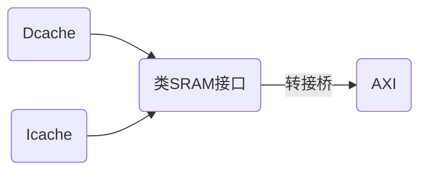

## 总体思路

## 类SRAM接口
### Dcache
**size**
0:1 byte,1:2 byte,2:4 byte 
后期可以考虑加入8
当 cache 发出写/读请求，需要指定 size
返回数据一般用 size=4 (返回一整line)
**ok**
|       |读             |写|
|-|-|-|
|addr_ok|地址被接收      |数据返回|
|data_ok|地址和数据被接收|数据写入完成|

读请求：先后接收到addr_ok和data_ok后流出
写请求：接收到addr_ok后流出

### Icache

### 结构
写入时有写buffer，由转接桥管理，当buffer满时便会阻塞addr_ok以阻塞命令，直到buffer空出；读取时，同时在buffer与总线中搜索。

### 问题
由于同时接受Icache与Dcache的请求，需要2端口吗？
从方发出的addr_ok信号不能依赖于req信号，Why?防止死锁？
req=1且addr_ok=0时，允许更改wr,size,addr,wstrb,wdata.Why?且为什么允许?与AXI有什么不同?

### 

